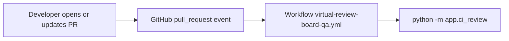
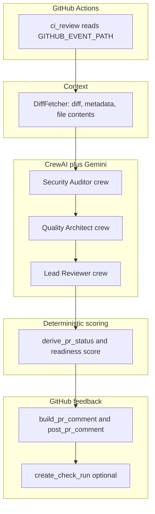
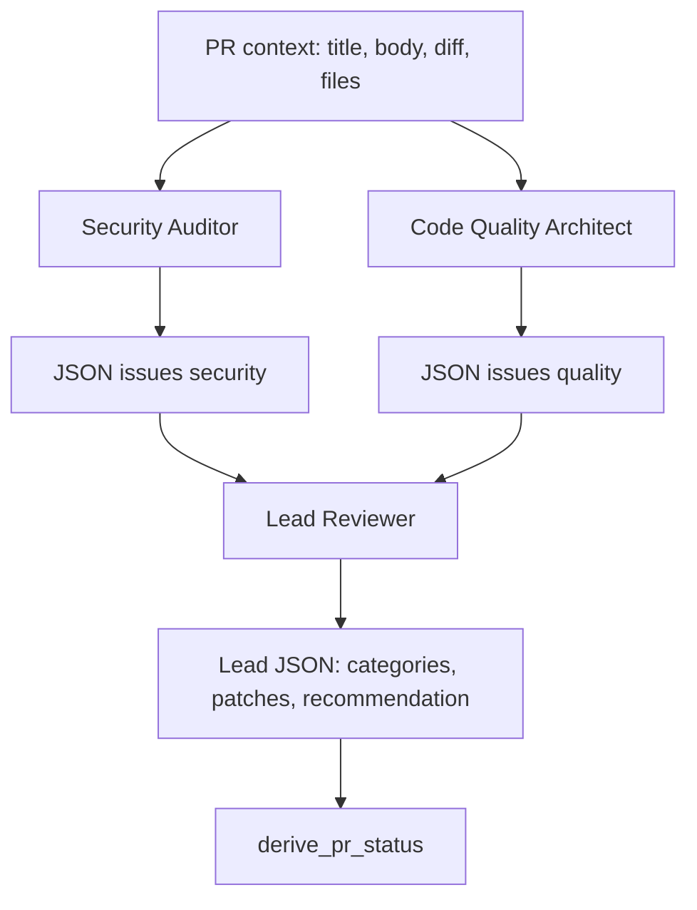
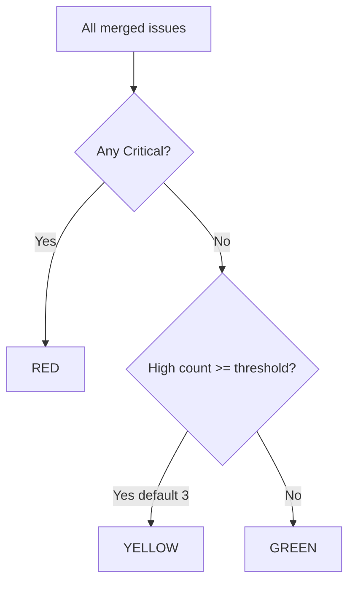
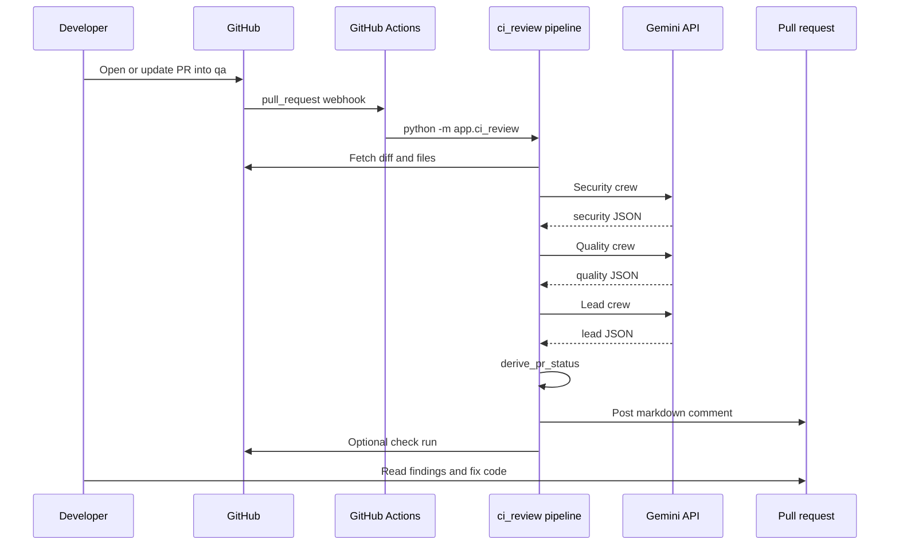

# Virtual Review Board — Showcase Overview

## Summary

Pull request review is essential but time-consuming. On busy teams, security and quality problems can slip through when reviewers are overloaded or when a PR is large and easy to skim.

The **Virtual Review Board** is an automated **Reviewer 0**: on every qualifying pull request into the `qa` branch, it fetches the PR diff and changed files, runs a multi-agent AI review (security, code quality, and a lead coordinator), applies deterministic scoring, and posts a single structured comment on the PR—plus an optional GitHub Check Run. Humans remain the final authority; this system gives them a consistent first pass with actionable findings before they spend deep review time.

**Outcomes for the team:**

- Structured findings with file, line, severity, rationale, and fix guidance
- A **readiness score** (0–100%) and **RED / YELLOW / GREEN** status for triage
- Optional suggested patch snippets in the PR comment
- Integration via GitHub Actions with minimal secrets and no long-running server

---

## When it runs

The workflow [`.github/workflows/virtual-review-board-qa.yml`](../.github/workflows/virtual-review-board-qa.yml) triggers on:

| Event | GitHub `action` | Condition |
|-------|-----------------|-----------|
| PR opened | `opened` | Base branch is `qa` |
| New commits pushed | `synchronize` | Base branch is `qa` |
| PR reopened | `reopened` | Base branch is `qa` |

Concurrency is configured per repository and PR number: if a developer pushes again while a review is still running, the in-progress job is cancelled and a fresh run starts.



---

## End-to-end pipeline

The review runs entirely inside GitHub Actions—there is no HTTP server in this repository. The entry point reads the webhook payload from `GITHUB_EVENT_PATH`, then delegates to a shared pipeline used for all review execution.



### Step-by-step (what happens on each run)

| Step | Component | What it does |
|------|-----------|--------------|
| 1 | `app/ci_review.py` | Loads the PR event, validates `action` (`opened`, `synchronize`, `reopened`), extracts owner, repo, PR number, and head commit SHA |
| 2 | `DiffFetcher` | Calls the GitHub API for the unified diff, changed-file metadata, and full file contents at the PR head (truncated by `MAX_DIFF_CHARS` and `MAX_FILE_CONTENT_CHARS`) |
| 3 | Security Auditor | One CrewAI crew with one task; model returns JSON `issues` (severity, location, line, why, fix, optional patch) |
| 4 | Code Quality Architect | Same JSON contract, focused on maintainability and quality |
| 5 | Lead Reviewer | Receives both specialist JSON blobs; produces merged categories, patches, and `final_recommendation` |
| 6 | `derive_pr_status` | Computes penalty from severity weights and sets **RED / YELLOW / GREEN** and readiness %—this **overrides** whatever status the lead model reported |
| 7 | `build_pr_comment` | Formats one markdown PR comment with all sections |
| 8 | `post_pr_comment` | Posts the comment via GitHub API |
| 9 | `create_check_run` | If enabled: check **fails** on RED, **succeeds** on YELLOW or GREEN; summary includes readiness score |

Key source files:

- Entry: [`virtual-review-board/app/ci_review.py`](../virtual-review-board/app/ci_review.py)
- Pipeline: [`virtual-review-board/app/review_pipeline.py`](../virtual-review-board/app/review_pipeline.py)
- Orchestration: [`virtual-review-board/app/crew/crew_runner.py`](../virtual-review-board/app/crew/crew_runner.py)
- Scoring: [`virtual-review-board/app/scoring/readiness_score.py`](../virtual-review-board/app/scoring/readiness_score.py)
- Comment formatting: [`virtual-review-board/app/utils/formatter.py`](../virtual-review-board/app/utils/formatter.py)

---

## Multi-agent “virtual review board”

Three specialized roles mirror a small review committee. Each role has a dedicated prompt file and CrewAI agent definition. Specialists run **sequentially** (security, then quality, then lead); each specialist invocation is a separate Crew with a single Task.



| Agent | Prompt file | Focus |
|-------|-------------|--------|
| Security Auditor | [`app/prompts/security_prompt.txt`](../virtual-review-board/app/prompts/security_prompt.txt) | Vulnerabilities, unsafe patterns, exploit scenarios |
| Code Quality Architect | [`app/prompts/quality_prompt.txt`](../virtual-review-board/app/prompts/quality_prompt.txt) | Maintainability, design, testing gaps |
| Lead Reviewer | [`app/prompts/lead_prompt.txt`](../virtual-review-board/app/prompts/lead_prompt.txt) | Merge specialist output; executive summary; no invented file paths |

The LLM backend is **Google Gemini** (configured via `GEMINI_MODEL`, default `gemini/gemini-3.5-flash`) using an API key from Google AI Studio. Orchestration uses **CrewAI**.

### Specialist JSON contract (simplified)

Each specialist must return JSON like:

```json
{
  "issues": [
    {
      "severity": "High",
      "title": "Short label",
      "location": "path/to/file.py",
      "line": 42,
      "why": "Rationale",
      "fix": "What to change",
      "patch": "optional unified diff snippet"
    }
  ],
  "notes": ["optional strings"]
}
```

If the model output is not valid JSON, the run degrades gracefully: empty `issues` plus a note in the report, and processing continues.

---

## Scoring and status (RED / YELLOW / GREEN)

Status and readiness score are computed in code—not left entirely to the model—so thresholds stay predictable across runs.

### Severity weights

| Severity | Weight (penalty points) |
|----------|-------------------------|
| Critical | 10 |
| High | 7 |
| Medium | 4 |
| Low | 1 |

### Readiness score

Penalty points are summed from all merged specialist issues. The readiness score maps that burden to a percentage using `READINESS_TOTAL_CHECKS` (default **20**): heavier findings drive the score down toward 0%.

### Status rules



| Status | Condition |
|--------|-----------|
| **RED** | At least one Critical issue |
| **YELLOW** | No Critical, but High issue count ≥ `HIGH_ISSUE_YELLOW_THRESHOLD` (default 3) |
| **GREEN** | Otherwise |

The lead reviewer’s `overall_status` and `readiness_score` in JSON are **replaced** by these deterministic values before the PR comment is built.

---

## Full review cycle (sequence)



---

## What developers see on the PR

A single markdown comment is posted per run (new comment each time the workflow completes—not necessarily threaded). Structure from `build_pr_comment`:

1. **Header** — app name (default `VirtualReviewBoard`)
2. **Overall status** — RED / YELLOW / GREEN with emoji
3. **Review readiness score** — percentage
4. **Critical issues** — file, line, why, fix, optional patch blocks
5. **High priority issues**
6. **Medium priority suggestions**
7. **Minor / optional improvements** (hidden by default via `INCLUDE_MINOR_IN_COMMENT=false`)
8. **Final recommendation** — narrative summary

If `ENABLE_GITHUB_CHECK_RUN` is true, a check appears on the commit with title like `Virtual Review Board — GREEN` and conclusion **failure** only when status is RED.

### Fictional example (illustrative only)

```markdown
## 🤖 VirtualReviewBoard Report

**Overall Status:** 🟡 YELLOW
**Review Readiness Score:** 72%

### 🔴 Critical Issues
_None detected._

### 🟠 High Priority Issues
- **[src/api/auth.py:88]** JWT verified without checking expiry
  - **Severity:** High
  - **Why:** Expired tokens would still be accepted.
  - **Fix:** Validate `exp` claim against current time before trusting the token.

### 🟡 Medium Priority Suggestions
- **[tests/test_auth.py]** Missing case for expired token
  - **Severity:** Medium
  - **Why:** Regression risk for the fix above.
  - **Fix:** Add a test that passes an expired JWT and expects 401.

### Final Recommendation
Address the JWT expiry check before merge; add the suggested test. No critical blockers, but treat as needs attention before production QA sign-off.
```

---

## Why this is useful

- **Earlier feedback** — Findings appear when the PR is opened or updated, not only when a human reviewer is available.
- **Consistent bar** — Every PR into `qa` gets the same security and quality lenses.
- **Actionable output** — Issues include location, line, rationale, and remediation; optional patches reduce guesswork.
- **Triage signal** — RED / YELLOW / GREEN and the readiness score help reviewers prioritize large queues.
- **Low integration cost** — One GitHub Actions workflow, one repository secret (`GOOGLE_API_KEY`), and the built-in `GITHUB_TOKEN` for API access.
- **Advisory by design** — Labeled as Reviewer 0; complements human review and branch protection rather than replacing them.

---

## Configuration and operations

### Required setup

| Item | Purpose |
|------|---------|
| Repository secret `GOOGLE_API_KEY` | Gemini API access (Google AI Studio) |
| `GITHUB_TOKEN` | Provided automatically in Actions |
| Branch `qa` | Workflow only runs for PRs **targeting** `qa` |

Workflow permissions: `contents: read`, `pull-requests: write`, `checks: write`.

### Environment variables (tunable)

| Variable | Default | Description |
|----------|---------|-------------|
| `GEMINI_MODEL` | `gemini/gemini-3.5-flash` | Model id for all crews |
| `GITHUB_APP_NAME` | `VirtualReviewBoard` | Comment and check run title |
| `READINESS_TOTAL_CHECKS` | `20` | Denominator for readiness score |
| `HIGH_ISSUE_YELLOW_THRESHOLD` | `3` | High issues needed for YELLOW |
| `MAX_DIFF_CHARS` | `120000` | Cap on diff size sent to the model |
| `MAX_FILE_CONTENT_CHARS` | `80000` | Cap per file content |
| `ENABLE_GITHUB_CHECK_RUN` | `true` | Post a check run on the commit |
| `LOG_LEVEL` | `INFO` | Structured logging in Actions logs |

See also [`virtual-review-board/.env.example`](../virtual-review-board/.env.example) and [`virtual-review-board/README.md`](../virtual-review-board/README.md).

### Cost, latency, and reliability

- **Three LLM crew runs** per workflow execution (security, quality, lead)—plan for API cost and roughly several minutes of job time depending on PR size and model.
- **Parse failures** — Specialist JSON errors yield empty issues and a note; lead parse failure falls back to YELLOW at 50% with a message to seek human review.
- **Fork PRs** — `GITHUB_TOKEN` from fork workflows may have limited permissions; same-repo PRs into `qa` work with the default token.

---

## Repository map

```
PR_Validation/
├── .github/workflows/
│   └── virtual-review-board-qa.yml    # Triggers on PRs to qa
├── docs/
│   └── Virtual-Review-Board-Showcase.md   # This document
└── virtual-review-board/
    ├── app/
    │   ├── ci_review.py               # Actions entry point
    │   ├── review_pipeline.py         # Fetch, run agents, post results
    │   ├── crew/crew_runner.py        # CrewAI orchestration
    │   ├── agents/                    # Agent definitions
    │   ├── prompts/                   # Role instructions
    │   ├── scoring/readiness_score.py # RED/YELLOW/GREEN logic
    │   ├── github/                    # API client, diff, comments, checks
    │   └── utils/formatter.py         # PR comment markdown
    ├── requirements.txt
    └── README.md                      # Operator setup guide
```

---

## Live demo script

Use this checklist to demonstrate the system to a colleague or stakeholder:

1. **Prepare** — Confirm the repo has the workflow on the default branch, `GOOGLE_API_KEY` is set, and a `qa` branch exists.
2. **Open a PR** — Create a branch with a small intentional issue (e.g. hardcoded secret or missing validation) and open a pull request **into `qa`**.
3. **Watch Actions** — In GitHub, open the **Actions** tab and select the job **Virtual Review Board (QA)**.
4. **Inspect the comment** — On the PR **Conversation** tab, find the new **VirtualReviewBoard** (or configured app name) comment; note status, score, and findings.
5. **Inspect the check** — On the PR **Checks** (or commit status), open the optional Virtual Review Board check run.
6. **Push a fix** — Commit a remediation and push; the `synchronize` event re-runs the board and posts an updated comment.
7. **Discuss value** — Compare time-to-first-feedback with waiting for a human reviewer; highlight structured severity and triage color.

---

## Guardrails and expectations

- Output is **advisory**; teams should keep human review and branch protection for merge decisions.
- Large PRs may be truncated by diff/file caps; very large changes may receive incomplete context.
- Model behavior can vary; deterministic scoring stabilizes **status** and **readiness %** but not every narrative phrase in the recommendation.
- Tune `HIGH_ISSUE_YELLOW_THRESHOLD` and severity prompts if the board is too noisy or too lenient for your team.

For setup and troubleshooting, use [`virtual-review-board/README.md`](../virtual-review-board/README.md).
